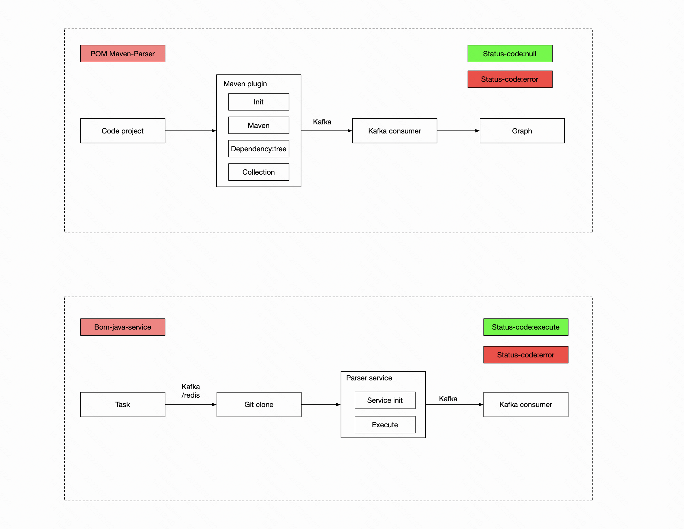
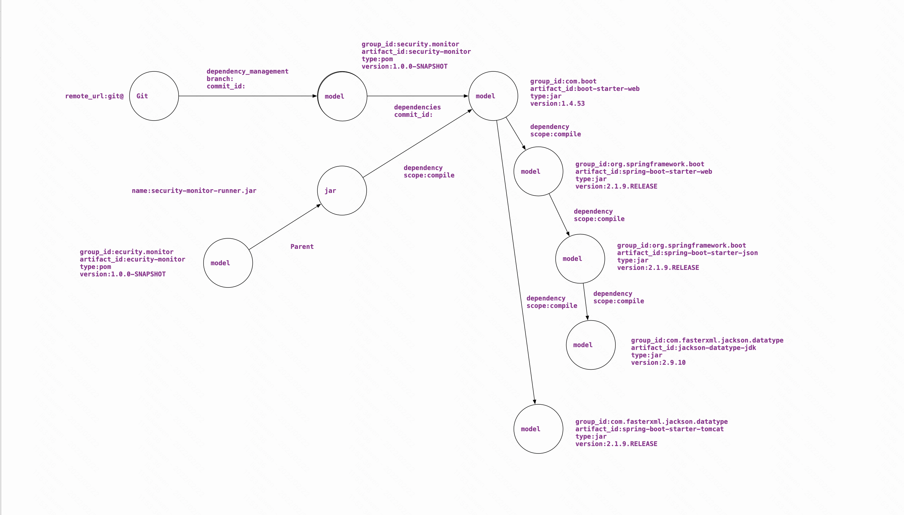
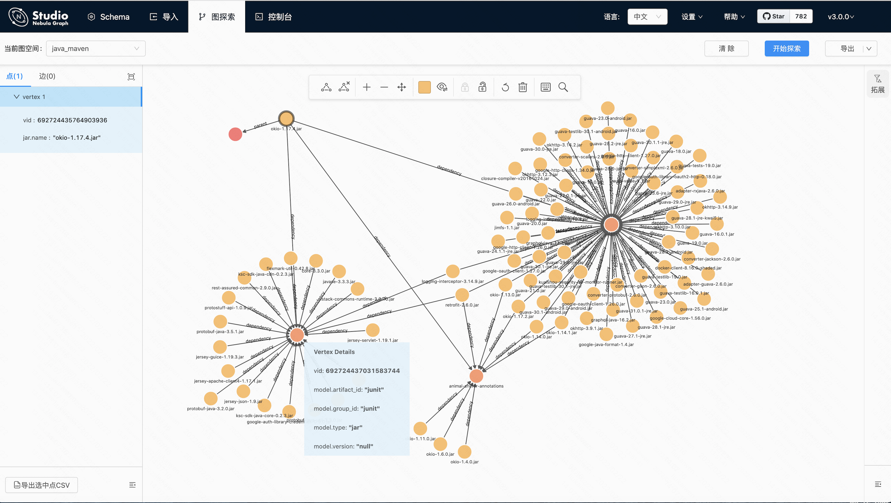

SECURITY-BOM_ANALYZE
三方组建依赖分析，依赖于nebula graph做深度索引

## Introduction
系统在19年年底完成demo编写，在log4j2安全应急中发现三方组建、安全资产侧的多方面缺陷，春节期间把demo重新做部分完善。
目前主要针对java-maven做分析，三种方式
- jar
- pom.xml
- maven plugin

数据存储
- nebula

## Install
### kafka
- https://kafka.apache.org/downloads
- create topic
```shell
./bin/kafka-topics.sh --create --zookeeper localhost:2181 --replication-factor 1 --partitions 1 --topic security_sca_pom
```
- start kafka and zk
```shell
./bin/zookeeper-server-start.sh config/zookeeper.properties
./bin/kafka-server-start.sh config/server.properties
./bin/kafka-console-consumer.sh --zookeeper localhost:2181 --topic security_sca_pom --from-beginning
./bin/kafka-console-consumer.sh --zookeeper localhost:2181 --topic security_sca_jar_pom --from-beginning
```

### nebula 
- 可视化使用:nebula-graph-studio-v3
- nebula docker:https://github.com/vesoft-inc/nebula-docker-compose.git

### mvn plugin
```shell
cd security-bom-analyze-maven-plugin
mvn install clear
```

## 架构
### service

### nebula 结构
- graph/maven.sql



## 结果图
可以看到哪些jar包依赖junit.junit\animal-sniffer-annotations\jsr305
